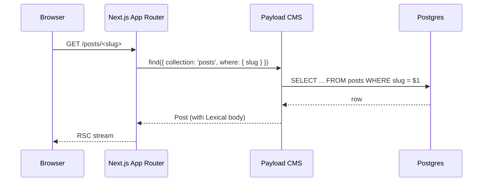

## Diagrams

<!-- PRIMARY comprehension surface. Reviewers should be able to grasp the full
change from the diagram(s) alone — Summary and code diff are supporting context,
not the primary explanation. Replace the example below with your own diagram(s).
Good shapes: data flows, sequence diagrams, state machines, component trees,
migration graphs, infra topology. Multiple diagrams are encouraged when the PR
spans layers. If the change genuinely cannot be diagrammed (one-line typo, dep
bump, comment-only), delete the block and write: N/A — <reason> -->

## Summary

<!-- 1–3 bullets supporting the diagram(s) above. Lead with the *why* — the
diagram shows the *what*. -->

-
-

## Screenshots

<!-- REQUIRED when this PR adds or modifies visible UI (any file under
src/app/** or src/components/**). Otherwise write "N/A — not UI".

Headless workflow for subagent-generated PRs: capture via Playwright (either
a test:e2e spec or an MCP drive), save under
docs/screenshots/<feature-slug>/<description>.png, commit with the PR, then
reference the file using an ABSOLUTE raw.githubusercontent URL with the
commit SHA captured at PR-creation time. Relative paths do NOT work in PR
bodies — GitHub resolves them against /pull/N/, not the repo root.

Pattern (inside a subagent bash HEREDOC):

    SHA=$(git rev-parse HEAD)
    gh pr create --body "...  ..."

Human-authored PRs can drag-and-drop the image directly into the comment box —
GitHub uploads it and inserts a working link. -->

## Test plan

<!-- Checklist of the verifications you ran. Reviewers expect all boxes checked
on a ready-to-merge PR. -->

- [ ] `npm run lint && npm run test` — green
- [ ] `npm run build` — clean production build (typechecks + bundles)
- [ ] New unit / integration tests added (if behavior changed)
- [ ] New Playwright e2e spec added (if user-visible behavior changed) —
      `npm run test:e2e`
- [ ] (UI only) Playwright MCP smoke — ran `npm run dev`, drove the feature
      via `mcp__plugin_playwright_playwright__browser_*` at ≥1 mobile (390×844) and ≥1
      desktop (1440×900) viewport, `browser_console_messages` returns no
      errors/warnings, and the Screenshots section was captured from those
      runs. Human-authored PRs may substitute direct browser interaction.
      Reviewers repeat the drive + console check via `gh pr checkout <N>` +
      `npm run dev` against the PR head SHA before approving.

## Plan reference

<!-- Link the issue, Linear ticket, brainstorm doc, or design doc this PR
implements. For out-of-plan work, write "Out of plan — <one-line reason>". -->

Closes #<issue> · See `docs/<relevant-doc>.md`

---

🤖 Generated with [Claude Code](https://claude.com/claude-code)
